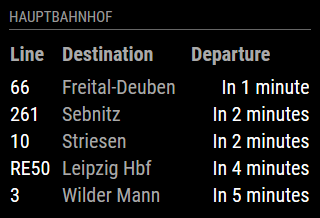

# MMM-DVB  [](https://travis-ci.org/skastenholz/MMM-DVB)

**Station monitor** for the **Dresden local transport (DVB)** bus, tram and train system.

This module is an extension of the [MagicMirror²](https://github.com/MichMich/MagicMirror) project by [MichMich](https://github.com/MichMich/).



## Installation

1. Navigate into your MagicMirror's `modules` folder.
1. Execute `git clone https://github.com/skastenholz/MMM-DVB.git`.
1. Execute `cd MMM-DVB`.
1. Execute `npm install`.

## Configuration

Sample minimum configuration entry for your `~/MagicMirror/config/config.js`:

```javascript
{
   module: 'MMM-DVB',
   position: 'top_left',
   config: {
      stopName: 'Hauptbahnhof' // Which stop would you like to have displayed?
   }
}
```

Sample configuration entry for your `~/MagicMirror/config/config.js` with optional parameters:

```javascript
{
   module: 'MMM-DVB',
   position: 'top_left',
   config: {
      stopName: 'Hauptbahnhof', // Which stop would you like to have displayed?
      timeOffset: 5,  // With how many minutes in advance should connections be displayed?
      resultNum: 5, // How many connections should be displayed?
      lines: ["1", "2"], // What lines should be displayed?
      directions: ["Striesen"], // What directions should be displayed?
      reload: 60000, // How often should the information be updated? (In milliseconds)
      noTableHeader: false, // suppress table header if true
      showRelative: true //show relative time to departure from the current moment (if less than 15 minutes) 
   }
}
```

## Dependencies

* npm
* [dvbjs](https://www.npmjs.com/package/dvbjs)

## Acknowledgements

* [MagicMirror²](https://github.com/MichMich/MagicMirror)
* [MMM-KVV](https://github.com/yo-less/MMM-KVV)
